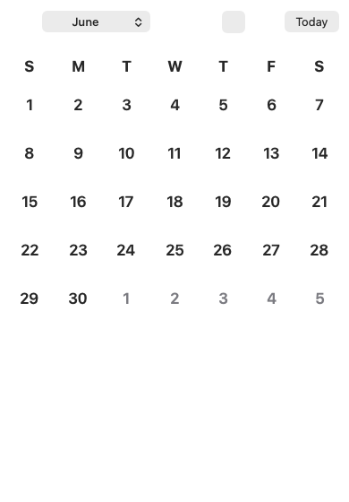
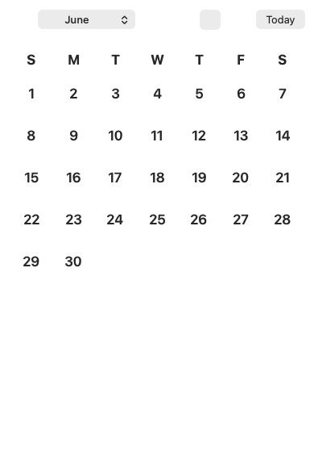
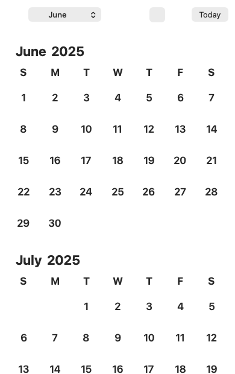

# SwiftUICalendar

[](https://github.com/maniramezan/SwiftUICalendar/actions/workflows/build.yml)
[](https://www.swift.org)
[](Package.swift)
[](https://swift.org/package-manager/)
[](https://maniramezan.github.io/SwiftUICalendar/documentation/swiftuicalendar/)

SwiftUICalendar is a SwiftUI calendar package with single, range, and multiple selection modes, built-in Gregorian and non-Gregorian calendar support, configurable scrolling, and customizable day rendering.

## Calendar Modes

These images are generated from the package snapshot references for the actual `CalendarView`.

| Normal | Horizontal | Vertical |
| --- | --- | --- |
|  |  |  |

## Requirements

- Swift 6.2+
- iOS 18+
- macOS 15+

## Installation

Add SwiftUICalendar with Swift Package Manager:

```swift
.package(url: "https://github.com/maniramezan/SwiftUICalendar.git", from: "0.1.0")
```

Then add the product to your target:

```swift
.product(name: "SwiftUICalendar", package: "SwiftUICalendar")
```

## Quick Start

```swift
import SwiftUI
import SwiftUICalendar

struct BookingView: View {
    @State private var calendar = CalendarViewModel(
        calendarIdentifier: .gregorian,
        selection: .range(nil, nil)
    )

    var body: some View {
        CalendarView(model: calendar)
            .frame(minHeight: 420)
    }
}
```

## Selection Modes

```swift
CalendarViewModel(calendarIdentifier: .gregorian, selection: .single(nil))
CalendarViewModel(calendarIdentifier: .gregorian, selection: .range(nil, nil))
CalendarViewModel(calendarIdentifier: .gregorian, selection: .multiple([]))
```

`selection` is mutable, so screens can read or replace it after user interaction:

```swift
switch calendar.selection {
case .single(let date):
    print(date as Any)
case .range(let start, let end):
    print(start as Any, end as Any)
case .multiple(let dates):
    print(dates)
}
```

## Theming

```swift
let theme = Theme()
theme.day.selectedBackgroundColor = .indigo
theme.day.todayBorderColor = .orange

let configuration = CalendarConfiguration(
    scrollMode: .horizontal,
    horizontalHeightMode: .hugContent
)

CalendarView(model: calendar, theme: theme, configuration: configuration)
```

## Grid Sizing

Day cells are always clamped between a minimum hit-target size and a maximum size. `gridSizing`
decides what happens to the leftover width when the container is wider than seven maximum-size
cells — a macOS window, an iPad, or a landscape iPhone.

```swift
let configuration = CalendarConfiguration(gridSizing: .compact)

CalendarView(model: calendar, configuration: configuration)
```

| Value | Behavior |
| --- | --- |
| `.adaptive` (default) | Fills the container while cells are below their maximum size, then centers a natural-width grid once they reach it. |
| `.compact` | Never stretches. The grid keeps its natural width and is centered in anything wider. |
| `.flexible` | Always fills the container, so day spacing grows with the window while cell height stays capped. |

Use `.compact` when the calendar should look identical regardless of window size, and `.flexible`
when it should track the full width of a resizable pane.

## Alternate Calendar Labels

Use the square dual-calendar day view to show a secondary day number from another calendar system:

```swift
let theme = Theme()
theme.day.useSquareDualCalendarDayView(secondaryLabel: .persian)

CalendarView(
    model: CalendarViewModel(calendarIdentifier: .gregorian),
    theme: theme
)
```

## Right-to-Left Support

Calendars whose native script reads right-to-left — Persian, Hebrew, and the Islamic
variants — automatically render with a mirrored, right-to-left layout, even on a left-to-right
system locale. Gregorian and other left-to-right calendars are unaffected.

```swift
CalendarView(model: CalendarViewModel(calendarIdentifier: .hebrew))
```

## Documentation

Build DocC locally:

```bash
bash ./scripts/build-docs.sh
```

The generated static documentation is written to `.build/docs`. CI validates DocC on pull requests and publishes the same output to GitHub Pages on pushes to `main`.

## Versioning

SwiftUICalendar follows semantic versioning for tagged releases, starting at `0.1.0`. During 0.x, source-breaking changes may ship in minor releases; patch releases preserve source compatibility.

## Development

```bash
swift package resolve
swift build -c debug
swift test
MINIMUM_COVERAGE=80 bash ./scripts/check-coverage.sh
bash ./scripts/build-docs.sh
```

`swift test` compares image snapshots by default. On machines used only for logic work,
`SNAPSHOT_ASSERTIONS=false swift test` explicitly skips snapshot suites. Release and PR checks
must run with assertions enabled. Use the same macOS and Xcode versions as CI when recording.

Snapshot references live in `Tests/SwiftUICalendarTests/Snapshot/__Snapshots__`. When recording snapshots, set `globalRecordMode = .all`, run the snapshot tests, then revert to `.missing` before committing.

## License

SwiftUICalendar is available under the MIT license. See [LICENSE](LICENSE) for details.

## Optional Composable Architecture support

MVVM remains the default. For reducer-owned state, enable the `TCA` SwiftPM trait on the
package dependency and link its `SwiftUICalendarTCA` product:

```swift
.package(url: "https://github.com/maniramezan/SwiftUICalendar", from: "0.1.0", traits: ["TCA"])
```

```swift
import ComposableArchitecture
import SwiftUICalendar
import SwiftUICalendarTCA

let state = try CalendarState(calendarIdentifier: .gregorian)
let store = Store(initialState: CalendarFeature.State(calendar: state)) {
    CalendarFeature()
}
let calendar = TCACalendarView(store: store)
```

`CalendarFeature` uses the same atomic domain transitions as `CalendarViewModel`. The view
renders store state and sends actions; it does not synchronize a second mutable model.
Parents can handle selection-change and rejected-navigation delegate actions.

The adapter selects TCA 1.25.5 on Swift 6.2/6.3 and TCA 1.26.2 on Swift 6.4+,
with compatible dependency constraints for each toolchain.
See [Architecture](Sources/SwiftUICalendar/SwiftUICalendar.docc/Architecture.md) for constraints,
state ownership, and integration details. Validate both `swift test` and `swift test --traits TCA`.
